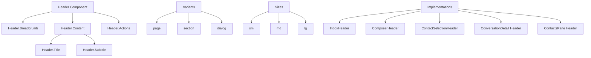

# Header Improvement Plan for shadcn Design Standards Compliance

## Overview
This plan outlines the approach to standardize all header components in the application to align with shadcn design standards, focusing on typography, spacing, color usage, layout, and component structure.

## Current Issues Identified
1. Inconsistent typography (font sizes, weights, line heights)
2. Inconsistent spacing between elements
3. Inconsistent color usage
4. Inconsistent structural patterns
5. Missing semantic HTML elements
6. Inconsistent border treatments

## Proposed Solution Architecture

### 1. Create a Standardized Header Component

We'll create a new `Header` component in `src/components/ui/Header.tsx` that follows shadcn patterns:

```typescript
type HeaderVariant = 'default' | 'page' | 'section' | 'dialog';
type HeaderSize = 'sm' | 'md' | 'lg';

interface HeaderProps {
  variant?: HeaderVariant;
  size?: HeaderSize;
  title?: string;
  subtitle?: string;
  icon?: React.ReactNode;
  actions?: React.ReactNode;
  breadcrumbs?: React.ReactNode;
  className?: string;
  children?: React.ReactNode;
}
```

### 2. Typography Scale Standardization

Based on shadcn standards and our design tokens:

- **Page Headers**: `text-3xl font-semibold tracking-tight` (48px)
- **Section Headers**: `text-xl font-semibold tracking-tight` (20px)
- **Component Headers**: `text-lg font-semibold` (18px)
- **Subtitles**: `text-sm text-muted-foreground` (14px)
- **Breadcrumbs/Labels**: `text-xs font-semibold uppercase tracking-wide text-muted-foreground` (12px)

### 3. Spacing Standardization

Based on shadcn's 4/8/12/16px spacing scale:

- **Header Container Padding**: `px-6 py-4` (24px horizontal, 16px vertical)
- **Element Spacing**: `space-y-2` (8px between stacked elements)
- **Icon-Text Gap**: `gap-2` (8px)
- **Action Button Gap**: `gap-3` (12px)

### 4. Color Usage Standardization

Using the defined color tokens:

- **Titles**: `text-foreground`
- **Subtitles**: `text-muted-foreground`
- **Icons**: `text-muted-foreground` (unless interactive)
- **Borders**: `border-border`
- **Backgrounds**: `bg-surface` (when needed)

### 5. Component Structure Patterns

#### Page Header Pattern
```jsx
<Header variant="page" size="lg">
  <Header.Breadcrumb>
    <Breadcrumb />
  </Header.Breadcrumb>
  <Header.Content>
    <Header.Title>Page Title</Header.Title>
    <Header.Subtitle>Page description</Header.Subtitle>
  </Header.Content>
  <Header.Actions>
    <Button>Primary Action</Button>
  </Header.Actions>
</Header>
```

#### Section Header Pattern
```jsx
<Header variant="section" size="md">
  <Header.Content>
    <Header.Title icon={<Icon />}>Section Title</Header.Title>
    <Header.Subtitle>Section description</Header.Subtitle>
  </Header.Content>
  <Header.Actions>
    <Button variant="outline" size="sm">Action</Button>
  </Header.Actions>
</Header>
```

#### Dialog Header Pattern
```jsx
<Header variant="dialog" size="sm">
  <Header.Content>
    <Header.Title>Dialog Title</Header.Title>
  </Header.Content>
  <Header.Actions>
    <Button variant="ghost" size="icon">
      <X className="h-4 w-4" />
    </Button>
  </Header.Actions>
</Header>
```

## Implementation Steps

### Phase 1: Foundation
1. Create the standardized Header component with variants
2. Define typography scale for headers
3. Standardize spacing values
4. Implement consistent color usage

### Phase 2: Migration
1. Refactor InboxHeader to use the new Header component
2. Refactor ComposerHeader to use the new Header component
3. Refactor ContactSelectionHeader to use the new Header component
4. Refactor ConversationDetail header section
5. Refactor ContactsPane header section

### Phase 3: Polish
1. Update all headers to use semantic HTML elements
2. Ensure consistent border treatments
3. Test responsive behavior
4. Verify accessibility compliance

## Specific Component Updates

### InboxHeader Updates
- Change from `text-3xl` to standardized page header typography
- Standardize spacing to `space-y-2`
- Add proper semantic structure
- Maintain existing icon and content structure

### ComposerHeader Updates
- Change from `text-3xl` to standardized page header typography
- Standardize spacing to `space-y-2`
- Move button to Header.Actions slot
- Add proper semantic structure

### ContactSelectionHeader Updates
- Change from `div` to semantic `header` element
- Standardize typography to section header scale
- Move button to Header.Actions slot
- Standardize spacing

### ConversationDetail Header Updates
- Extract header content into Header component
- Standardize typography and spacing
- Maintain responsive behavior
- Ensure proper semantic structure

### ContactsPane Header Updates
- Extract header content into Header component
- Standardize typography and spacing
- Maintain tab navigation structure
- Ensure proper semantic structure

## Testing Strategy

1. **Visual Regression Testing**: Ensure headers render consistently across viewports
2. **Accessibility Testing**: Verify proper heading hierarchy and screen reader compatibility
3. **Responsive Testing**: Ensure headers adapt properly to different screen sizes
4. **Interaction Testing**: Verify all interactive elements work as expected

## Success Criteria

1. All headers use consistent typography from the defined scale
2. All headers use consistent spacing from the design token system
3. All headers use consistent color applications
4. All headers use semantic HTML elements
5. All headers have consistent border treatments
6. All headers are responsive and accessible
7. Code is maintainable and follows React best practices

## Mermaid Diagram: Header Component Architecture



## Conclusion

By implementing this standardized Header component and migrating all existing headers to use it, we'll achieve consistency with shadcn design standards while maintaining the existing functionality and improving code maintainability.