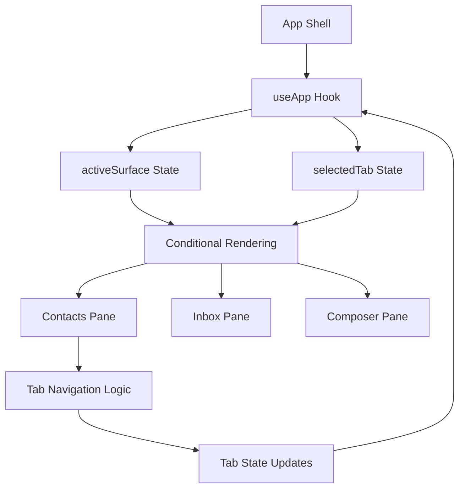
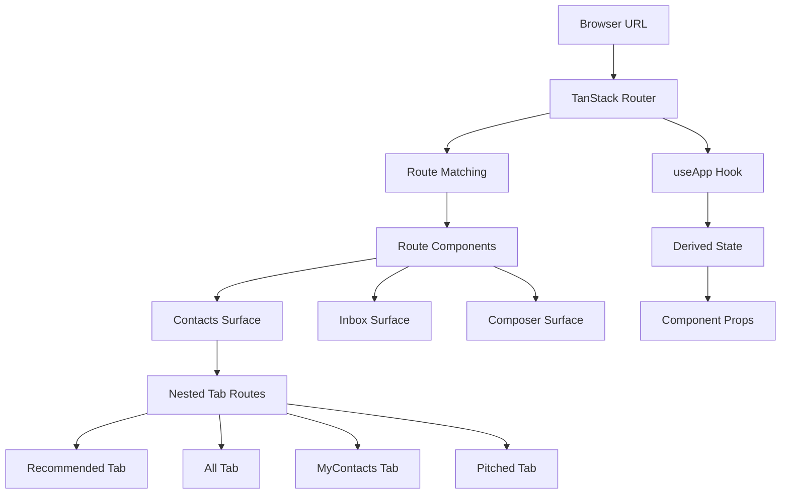
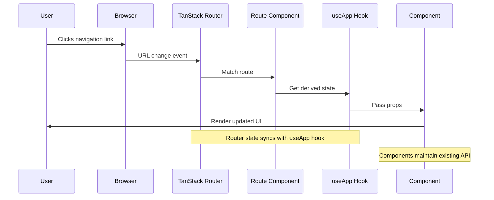
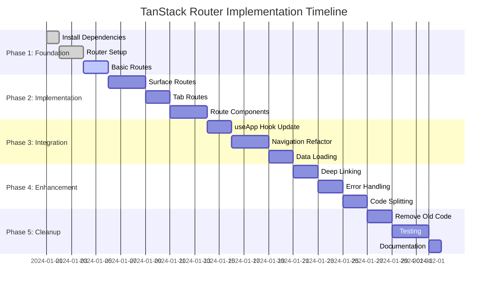
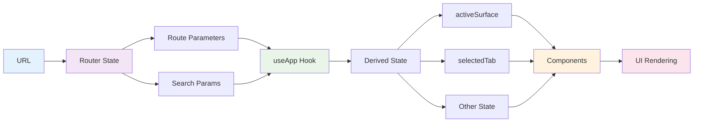

# TanStack Router Architecture Diagram

## Current vs. Proposed Navigation Flow

### Current State-Based Navigation


### Proposed URL-Based Navigation


## Route Hierarchy Structure

```mermaid
graph TD
    A[/ - Root] --> B[Redirect to /contacts/recommended]
    C[/contacts] --> D[Redirect to /contacts/recommended]
    E[/contacts/recommended] --> F[ContactsSurface + RecommendedTab]
    G[/contacts/all] --> H[ContactsSurface + AllTab]
    I[/contacts/myContacts] --> J[ContactsSurface + MyContactsTab]
    K[/contacts/pitched] --> L[ContactsSurface + PitchedTab]
    M[/inbox] --> N[InboxSurface]
    O[/composer] --> P[ComposerSurface]
    
    style A fill:#e1f5fe
    style B fill:#fff3e0
    style C fill:#e8f5e8
    style D fill:#fff3e0
    style E fill:#e8f5e8
    style F fill:#f3e5f5
    style G fill:#e8f5e8
    style H fill:#f3e5f5
    style I fill:#e8f5e8
    style J fill:#f3e5f5
    style K fill:#e8f5e8
    style L fill:#f3e5f5
    style M fill:#e8f5e8
    style N fill:#f3e5f5
    style O fill:#e8f5e8
    style P fill:#f3e5f5
```

## Component Integration Flow



## Migration Strategy Phases



## State Management Flow



## File Structure After Implementation

```mermaid
graph TD
    A[src/] --> B[index.tsx]
    A --> C[App.tsx]
    A --> D[router.ts]
    A --> E[routes/]
    E --> F[__root.tsx]
    E --> G[index.tsx]
    E --> H[contacts/]
    H --> I[index.tsx]
    H --> J[recommended.tsx]
    H --> K[all.tsx]
    H --> L[myContacts.tsx]
    H --> M[pitched.tsx]
    E --> N[inbox.tsx]
    E --> O[composer.tsx]
    A --> P[hooks/]
    P --> Q[useApp.tsx]
    A --> R[app/]
    R --> S[components/]
    S --> T[AppShell.tsx]
    S --> U[ShellContent.tsx]
    
    style E fill:#e8f5e8
    style H fill:#f3e5f5
    style P fill:#fff3e0
    style R fill:#fce4ec